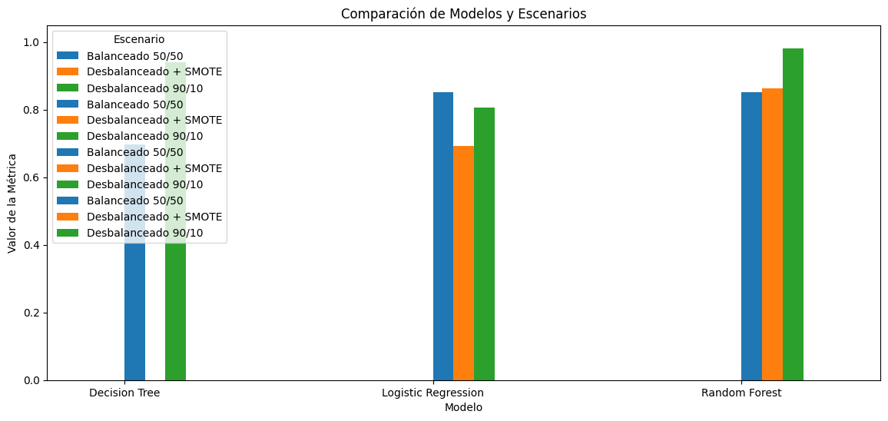

# Reto de predicción de incumplimiento de créditos

## Descripción
Este repositorio contiene la solución a un reto de Ciencia de Datos basado en un **caso real de un banco en México**. El objetivo principal es **predecir clientes con alta probabilidad de incumplir pagos de créditos**, utilizando técnicas de machine learning y análisis exploratorio de datos.

Se construyeron y evaluaron varios modelos predictivos, considerando escenarios de **dataset balanceado, desbalanceado y desbalanceado con SMOTE**, para optimizar la gestión de riesgo crediticio.

---

## Objetivos del Proyecto
1. Analizar y limpiar los datos de clientes.
2. Explorar correlaciones y patrones relevantes que afectan el incumplimiento de pagos.
3. Entrenar y comparar los siguientes modelos de clasificación:
   - Regresión Logística
   - Decision Tree
   - Random Forest
4. Evaluar desempeño de los modelos mediante:
   - Accuracy
   - Recall (sensibilidad)
   - F1-Score
   - AUC (Área bajo la curva ROC)
5. Diseñar una estrategia de crédito basada en los resultados para uso por personal no técnico.

---

## Variables del Dataset
- `IncumplimientoPago` (0 = Pagó, 1 = No Pagó) → Variable objetivo  
- `UsoCreditoDisponible`  
- `EdadCliente`  
- `Retrasos30_59Dias`  
- `PorcentajeDeDeuda`  
- `IngresoMensual`  
- `LineasCreditoActivas`  
- `Retrasos90DiasOMas`  
- `PrestamosInmobiliarios`  
- `Retrasos60_89Dias`  
- `CantidadDependientes`  

> Nota: Algunos valores faltantes se encuentran en `IngresoMensual` y `CantidadDependientes`.

---

## Resultados Principales
- El **Random Forest** entrenado sobre el **dataset desbalanceado + SMOTE** mostró el mejor equilibrio entre precisión y recall.  
- Variables más importantes para la predicción:
  - `Retrasos30_59Dias`  
  - `UsoCreditoDisponible`  
  - `PorcentajeDeDeuda`  
- Estrategia recomendada:
  1. Evaluar probabilidad de incumplimiento con Random Forest.  
  2. Clasificar clientes en riesgo: bajo, medio, alto.  
  3. Visualizar resultados en dashboard para personal no técnico.  
  4. Reentrenar modelos periódicamente para mantener desempeño.

---

## Imagen Representativa

---

## Librerías Utilizadas
- Python 3.9+
- pandas  
- numpy  
- matplotlib  
- seaborn  
- scikit-learn  
- imbalanced-learn (SMOTE)  
- graphviz  

---

## Cómo Ejecutar
Ejecuta el archivo .ipynb desde Google Colab
